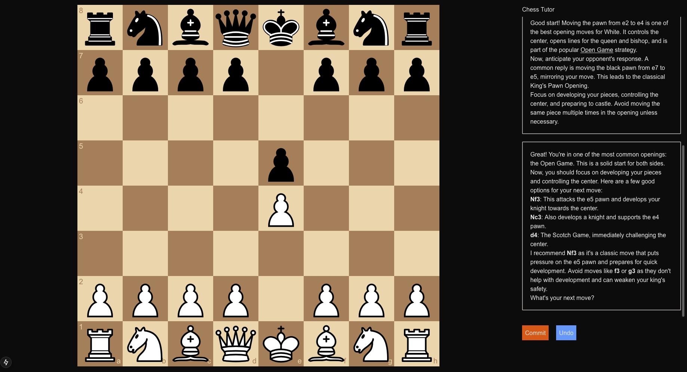

# Chess Tutor



This is an open-source project to help beginner player's imrpove their understanding of chess principles and develop basic chess vision.

It leverages an LLM (`openai/gpt-4o`) to analyze the position and provide feedback to the user and using another, separate system prompt to play against the user.


## Features

- **Multi-LLM**: this project utilizes two LLMs, one as a coach and the other as an opponent
  - **Coach**: [`openai/gpt-4o`](https://openrouter.ai/openai/gpt-4o) because it's a pretty good all-around model
  - **Opponent**: [`openai/gpt-4o-mini`](https://openrouter.ai/openai/gpt-4o) because it's a pretty good all-around model and plays pretty well when provided with the list of legal moves
    - **Note*: previously the opponent was using [`openai/gpt-3.5-turbo-instruct`](https://openrouter.ai/openai/gpt-3.5-turbo-instruct) because there's some [anecdotal evidence that it's better at playing chess](https://dynomight.net/chess/) than other models - if it doesn't provide a valid move after 4 attempts we choose a random valid move for the Opponent
- **Advice**: the player can right click on a piece with valid moves to ask the Coach what it thinks about moving that piece
- **Analysis**: the Coach will provide an ongoing analysis after each player and Opponent move
- **Undo**: the player can undo and redo moves, checking the Coach's analysis and viewing the possible Opponent responses before finally committing to a move and allowing the Opponent to play
- **View Opponent Moves**: before committing to a move, the player can click on Opponent pieces to see their possible moves, allowing them to consider the Opponent's possible responses before committing to a move - they can also right click on a piece to ask the Coach about the relative strength of that opponent move
- **Real-time Evaluation**: the [Stockfish](https://stockfishchess.org/) evaluation of the position is displayed in real-time as you play, allowing you to see the impact that each move and opponent response has on your chances of winning

## Development Info

This is a [Next.js](https://nextjs.org) project bootstrapped with [`create-next-app`](https://nextjs.org/docs/app/api-reference/cli/create-next-app).

## Getting Started

Clone or download the repo:

```bash
git clone git@github.com:DVDAGames/chess-tutor.git
```

Change into the project directory:

```bash
cd chess-tutor
```

Install the dependencies:

```bash
npm install
```

Copy the `.example.env` file to `.env` and add your [OpenAI API key](https://help.openai.com/en/articles/9186755-managing-your-work-in-the-api-platform-with-projects):

```bash
cp .example.env .env
```

Run the development server:

```bash
npm run dev
```

Open [http://localhost:3000](http://localhost:3000) with your browser interact with the chess tutor.

### Learn More

To learn more about Next.js, take a look at the following resources:

- [Next.js Documentation](https://nextjs.org/docs) - learn about Next.js features and API.
- [Learn Next.js](https://nextjs.org/learn) - an interactive Next.js tutorial.

You can check out [the Next.js GitHub repository](https://github.com/vercel/next.js) - your feedback and contributions are welcome!

### Deploy on Vercel

The easiest way to deploy your Next.js app is to use the [Vercel Platform](https://vercel.com/new?utm_medium=default-template&filter=next.js&utm_source=create-next-app&utm_campaign=create-next-app-readme) from the creators of Next.js.

Check out our [Next.js deployment documentation](https://nextjs.org/docs/app/building-your-application/deploying) for more details.
